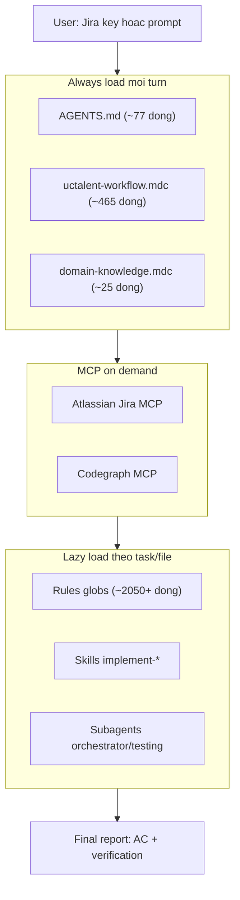
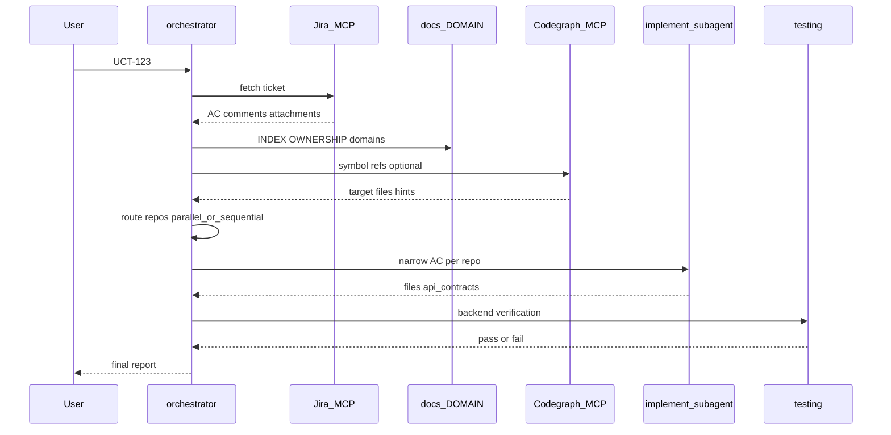
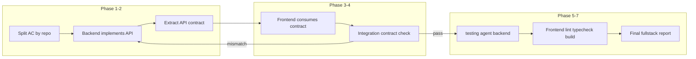
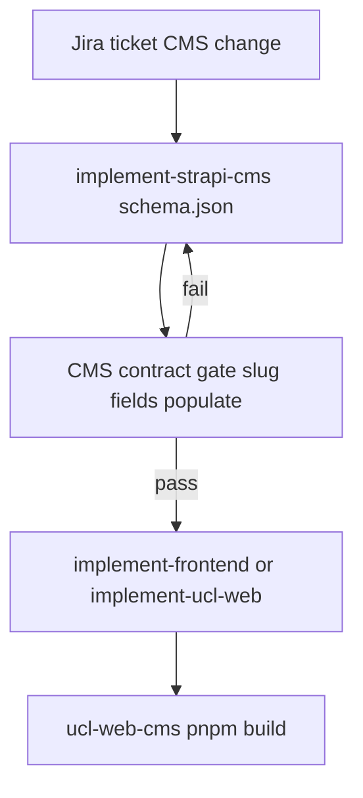
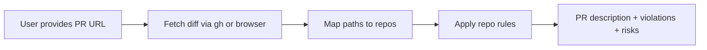
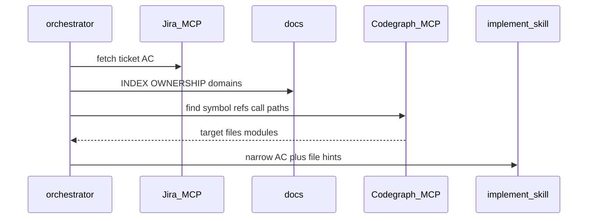
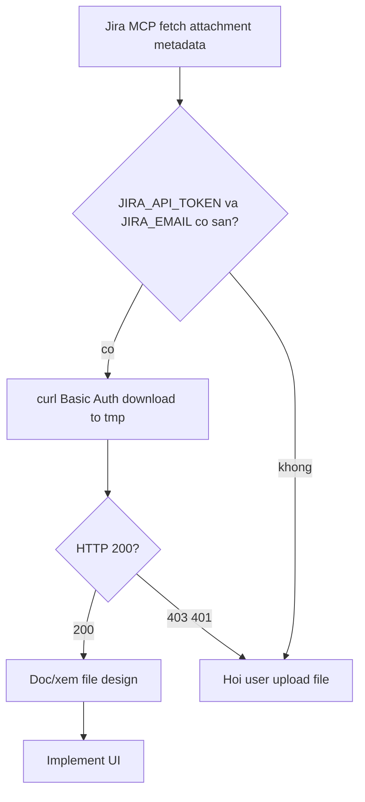
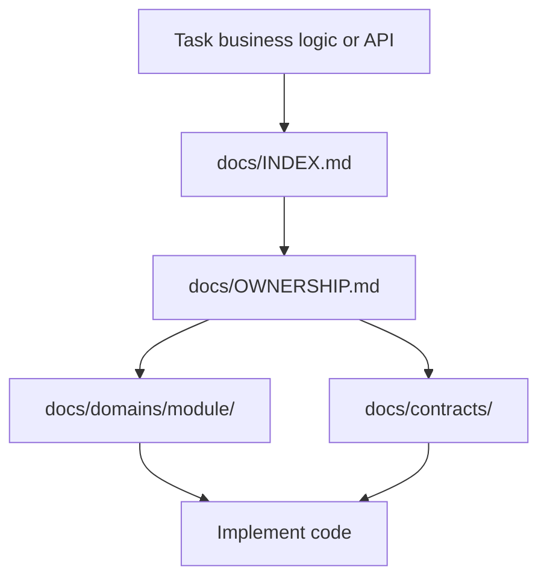
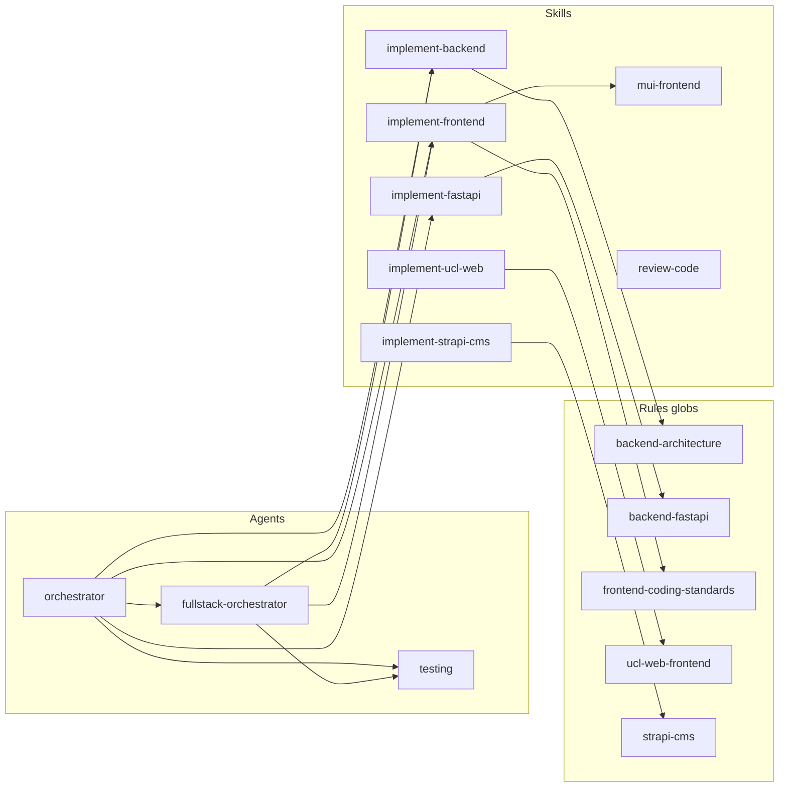

# Báo cáo Workflow Cursor AI Agent — UC Talent Workspace

> **Mục đích:** Tài liệu đầy đủ mô tả cách hệ thống AI agent UC Talent hoạt động — dùng để onboarding team, báo cáo nội bộ, và tra cứu workflow.
>
> **Phạm vi:** [`AGENTS.md`](AGENTS.md), [`.cursor/`](.cursor/), [`docs/`](docs/INDEX.md)  
> **Workspace root:** `uc-talent/` (parent folder chứa tất cả sibling repos)  
> **Ngôn ngữ:** Tiếng Việt  
> **Cập nhật:** theo trạng thái config hiện tại (Cursor-only)

---

## Mục lục

1. [Tổng quan cho team](#1-tổng-quan-cho-team)
2. [Workspace & Repos](#2-workspace--repos)
3. [Hệ thống Rules](#3-hệ-thống-rules)
4. [Skills (Implementation)](#4-skills-implementation)
5. [Subagents (Orchestration)](#5-subagents-orchestration)
6. [Luồng workflow end-to-end](#6-luồng-workflow-end-to-end)
7. [MCP Servers (Jira, Codegraph) & Attachment policy](#7-mcp-servers-jira-codegraph--attachment-policy)
8. [Domain knowledge (`docs/`)](#8-domain-knowledge-docs)
9. [API Contract Gate](#9-api-contract-gate)
10. [Verification & Command policy](#10-verification--command-policy)
11. [Final report template](#11-final-report-template)
12. [Hard rules & anti-patterns](#12-hard-rules--anti-patterns)
13. [Hướng dẫn team (Quick start)](#13-hướng-dẫn-team-quick-start)
14. [Bảo trì config](#14-bảo-trì-config)
- [Phụ lục](#phụ-lục)

---

## 1. Tổng quan cho team

### 1.1 Hệ thống này là gì?

UC Talent workspace dùng **Cursor Agent** với cấu hình tập trung tại parent folder `uc-talent/`. Agent được thiết kế theo nguyên tắc:

| Nguyên tắc | Mô tả |
|------------|-------|
| **Jira-first** | Ticket Jira là nguồn sự thật; agent fetch qua MCP trước khi code |
| **Multi-repo** | 7 sibling repos; chỉ sửa repo liên quan acceptance criteria |
| **Contract-safe** | Fullstack ticket: backend sở hữu API contract; frontend consume contract đã xác nhận |
| **Attachment-aware** | Jira screenshot/design: MCP metadata → API-token fallback (`JIRA_API_TOKEN`) → user upload |
| **Verification gate** | Backend qua `testing` agent; frontend qua lint/typecheck/build |
| **Code navigation** | Codegraph MCP (optional) — tìm symbol, definition, reference trước khi sửa code lạ |
| **Small diffs** | Thay đổi nhỏ, tập trung AC; không refactor rộng trừ khi ticket yêu cầu |

### 1.2 Cách dùng nhanh (hàng ngày)

1. Mở **Cursor** tại folder `uc-talent/` (không mở từ child repo).
2. Đảm bảo **Jira MCP** (Atlassian) đã login.
3. Trong Agent chat, chỉ cần gõ Jira key:

```txt
UCT-123
```

Agent tự động hành xử như thể bạn đã gõ:

```txt
Use orchestrator for UCT-123.
Fetch ticket via Jira MCP, route repos, implement, verify contracts, report status.
```

**Không cần:** paste full ticket, gõ "use orchestrator", hay chỉ định repo (trừ khi muốn override).

### 1.3 Kiến trúc 4 lớp context

Workspace có **4 lớp** bổ trợ agent — 3 lớp config Cursor + 1 lớp MCP code navigation:



| Lớp | Thành phần | Khi nào dùng |
|------|------------|--------------|
| **1 — Router** | `AGENTS.md` | Mỗi Agent turn — baseline workspace |
| **2 — Workflow + domain** | `uctalent-workflow.mdc`, `domain-knowledge.mdc` | Mỗi turn (`alwaysApply: true`) |
| **3 — Code navigation** | **Codegraph MCP** | Explore phase — tìm symbol/reference/call path (optional, khuyến nghị) |
| **4 — Lazy implement** | Rules (globs), Skills, Subagents | Khi implement đúng repo/file/task |
| **MCP ticket** | **Atlassian Jira MCP** | Có Jira key — fetch ticket trước khi code |

**Lưu ý:** `AGENTS.md` là **router mỏng** — không chứa full workflow. Chi tiết MCP tại [§7](#7-mcp-servers-jira-codegraph--attachment-policy).

---

## 2. Workspace & Repos

### 2.1 Layout

```txt
uc-talent/                         ← MỞ CURSOR TẠI ĐÂY
├── AGENTS.md                      ← Workspace router
├── .cursor/                       ← Agents, rules, skills, MCP config
├── .codegraph/                    ← Codegraph daemon state (transient, gitignored)
├── docs/                          ← Domain knowledge (INDEX, OWNERSHIP, domains/)
├── uc-talent-backend/             ← NestJS Backend V2
├── uc-backend-fastapi/            ← FastAPI: UPP, CV, job rec, queues
├── uc-embedding-fastapi/          ← FastAPI: embeddings, vector search
├── uc-frontend-nextjs-v1/         ← Next.js + MUI (main web app)
├── uc-ats-react-app/              ← React + MUI (ATS dashboard)
├── ucl-web/                       ← Next.js + Tailwind/shadcn (Unchain Labs)
└── ucl-web-cms/                   ← Strapi 5 CMS
```

### 2.2 Bảng repos

| Repo | Stack | Mục đích |
|------|-------|----------|
| `uc-talent-backend/` | NestJS, TypeORM, DDD Hexagonal | Main API V2 — GraphQL/REST, jobs, referrals, organizations, talents, rewards |
| `uc-backend-fastapi/` | FastAPI, Pydantic v2 | UPP runtime, CV parsing, job recommendation, queue consumers |
| `uc-embedding-fastapi/` | FastAPI | Embeddings, vector search, OpenSearch/Elasticsearch indexing |
| `uc-frontend-nextjs-v1/` | Next.js + MUI + `sx` | Public site, job board, talent portal |
| `uc-ats-react-app/` | React + MUI + `sx` | ATS dashboard, HR workflow, candidate pipeline |
| `ucl-web/` | Next.js 16, Tailwind 4, shadcn | Unchain Labs marketing site, insights, AEO |
| `ucl-web-cms/` | Strapi 5 | CMS cho UCL + UCTalent content |

### 2.3 Quy tắc path

**Luôn dùng workspace-root paths:**

```txt
uc-talent-backend/src/modules/job/...
uc-frontend-nextjs-v1/src/...
ucl-web-cms/src/api/...
```

**Tránh** bare paths trừ khi đã xác nhận CWD là child repo:

```txt
src/...          ← SAI khi mở từ parent workspace
app/...
components/...
```

### 2.4 Backend V2 structure (NestJS)

Code mới **chỉ** thêm vào `uc-talent-backend/src/modules/*`:

```txt
uc-talent-backend/src/modules/<module>/
├── presentation/     ← Controllers, resolvers, DTOs
├── application/      ← Use cases, Port In/Out interfaces
├── domain/           ← Pure TypeScript entities, domain logic
└── infrastructure/   ← TypeORM entities, repositories, adapters
```

**Không** thêm Backend V2 code vào legacy `src/domains/*`.

### 2.5 Child repo rules

Một số child repo có `.cursor/rules/` riêng (vd. `uc-talent-backend/.cursor/rules/`). Chỉ áp dụng khi session mở từ child repo. **Workflow chuẩn:** luôn mở từ `uc-talent/`.

---

## 3. Hệ thống Rules

Rules nằm tại [`.cursor/rules/`](.cursor/rules/). Cursor kích hoạt rule theo **frontmatter** (`alwaysApply` / `globs`) — không theo bảng trong `AGENTS.md`.

### 3.1 Cơ chế activation

| Chế độ | Frontmatter | Rules | Khi nào load |
|--------|-------------|-------|--------------|
| **Always** | `alwaysApply: true` | `uctalent-workflow`, `domain-knowledge` | Mỗi Agent turn |
| **Globs** | `globs: <pattern>` | 7 rules repo-specific | Khi agent sửa/đọc file khớp pattern |

### 3.2 Rules `alwaysApply: true`

#### `uctalent-workflow.mdc` (~465 dòng)

Single source of truth cho toàn bộ workflow:

- Workspace paths, repo map, routing table (§1–§2, §7)
- Jira MCP first, bare Jira key, attachment policy + API-token fallback (§3–§4, §4.1)
- Orchestrator, parallel/sequential subagents (§5–§6)
- Repo-specific rules index, testing, API contract gate (§8–§10)
- Command policy, file management, scope control (§11–§13)
- Final report requirements, hard rules (§14–§15)

#### `domain-knowledge.mdc` (~25 dòng)

Nhắc agent đọc `docs/` **trước** khi thêm use case, port, endpoint, business logic:

1. `docs/INDEX.md` + `docs/OWNERSHIP.md`
2. `docs/domains/<module>/` cho NestJS module
3. `docs/contracts/` cho cross-repo
4. `docs/services/fastapi/` hoặc `docs/services/embedding/` cho FastAPI
5. `docs/contracts/frontend-api-map.md` cho frontend API consumers

**Anti-duplication:** Không duplicate UPP/CV/embedding logic trong NestJS; không copy OpenAPI vào markdown.

### 3.3 Rules `globs` (repo-specific)

| Rule | Glob pattern | ~Dòng | Nội dung chính |
|------|--------------|-------|----------------|
| `backend-architecture.mdc` | `uc-talent-backend/src/modules/**/*.ts` | ~491 | DDD Hexagonal: dependency rule, layer responsibilities, Port In/Out, mapping ownership, controller flow, use case rules, ORM persistence, transactions, domain events, API contract ownership, legacy policy |
| `backend-coding-standards.mdc` | `uc-talent-backend/src/modules/**/*.ts` | ~347 | Formatting, pnpm commands, TypeScript explicit types, import order, naming conventions, layer suffixes, NestJS usage scope, error handling, DTO/Command/Result separation, ORM rules, API contract rules, AI assistant rules |
| `backend-project-architechture.mdc` | `uc-talent-backend/src/modules/**/*.ts` | ~452 | Module root structure, file placement per layer, module composition, file placement by task (REST, GraphQL, write/read workflow, domain rule, persistence, external integration), shared code, legacy boundary, path aliases |
| `backend-fastapi.mdc` | `uc-backend-fastapi/**/*.py`, `uc-embedding-fastapi/**/*.py` | ~145 | Thin routes / fat services, DI via Depends, service patterns A/B/C (UPP functions, Job rec classes, CV async), auth mechanisms, Pydantic camelCase/snake_case, pytest structure |
| `frontend-coding-standards.mdc` | `{uc-frontend-nextjs-v1,uc-ats-react-app}/**/*.{ts,tsx,js,jsx}` | ~522 | TypeScript, React hooks, MUI + `sx`, API contract verification, data fetching patterns, forms, state management, error/loading/empty states, a11y, Next.js vs ATS specifics, import rules, verification checklist |
| `ucl-web-frontend.mdc` | `ucl-web/**/*.{ts,tsx,js,jsx}` | ~44 | Next.js 16, Tailwind 4, shadcn/radix, cmsService, không MUI |
| `strapi-cms.mdc` | `ucl-web-cms/**/*` | ~55 | Strapi 5 schema structure, consumers map, CMS contract gate, verification |

**Tại sao không `alwaysApply` cho coding rules?** Ticket Strapi-only không nên inject 1.290 dòng NestJS DDD. Globs đảm bảo rule vào đúng lúc implement đúng repo.

---

## 4. Skills (Implementation)

Skills tại [`.cursor/skills/`](.cursor/skills/). **Không** auto-inject mỗi turn — agent load khi task khớp hoặc user invoke (`@skill`, `$mui-frontend`).

### 4.1 Bảng tổng hợp

| Skill | Repo target | Rules liên quan | Khi dùng |
|-------|-------------|-----------------|----------|
| `implement-backend` | `uc-talent-backend/` | 3 backend rules (auto globs) | NestJS V2 module work |
| `implement-fastapi` | `uc-backend-fastapi/`, `uc-embedding-fastapi/` | `backend-fastapi` (auto globs) | FastAPI routes, services, tests |
| `implement-frontend` | `uc-frontend-nextjs-v1/`, `uc-ats-react-app/` | `frontend-coding-standards` (auto globs) + **`mui-frontend` (skill bắt buộc)** | MUI UI implementation |
| `mui-frontend` | MUI apps — **required bởi `implement-frontend`** | resources/ styling guides | UI taste, components, `sx`, responsive, forms, dialogs, tables |
| `implement-ucl-web` | `ucl-web/` | `ucl-web-frontend` | Tailwind/shadcn, cmsService |
| `implement-strapi-cms` | `ucl-web-cms/` | `strapi-cms` | Content types, schema, CMS API |
| `nextjs-best-practices` | `uc-frontend-nextjs-v1/` only | — | Server/Client Components, routing, caching |
| `review-code` | Tất cả repos | rules theo repo | PR review + generate PR description |

### 4.2 `implement-backend`

**Workflow:**

0. Đọc `docs/OWNERSHIP.md` + `docs/domains/<module>/`
1. Explore — Port In → UseCase → Port Out
2. Plan — layers, Port tokens, mappers
3. Implement — dependency rule; Port In chỉ trong controller
4. Verify — `read_lints` trên file `.ts` đã sửa
5. Tests — unit + integration
6. Run — `Agent(testing)` hoặc user-approved `pnpm test`
7. Report JSON

**Input:** `task_summary`, `acceptance_criteria`, `affected_files`, `api_contracts` (optional)

**Output JSON mẫu:**

```json
{
  "backend_stack": "nestjs",
  "files_modified": [],
  "ports_added": [],
  "endpoints_added": [],
  "database_changes": [],
  "tests_added": 0,
  "testing_agent": { "tests_pass": true },
  "lint_clean": true
}
```

**Verify:** `cd uc-talent-backend && pnpm format && pnpm lint && pnpm test`

**Hard rules:** Ask before lint/test/migrations; không tạo `.md` trừ khi user yêu cầu.

### 4.3 `implement-fastapi`

**Workflow:**

0. Đọc `docs/services/fastapi/` + `docs/contracts/nestjs-fastapi.md`
1. Explore — match `src/api/routes/`, `src/services/`, `src/schemas/`
2. Plan — service pattern A/B/C; migration nếu DB
3. Implement — schemas → service → route → register `main.py`
4. Verify — `read_lints` trên `.py`
5. Tests — `tests/unit/` hoặc `tests/integration/`
6. Report JSON

**Service patterns:**

| Domain | Pattern | Return shape |
|--------|---------|--------------|
| UPP, referrals, points | A — functions | `(Optional[str], result)` |
| Job search, AI orchestration | B — classes | Pydantic model hoặc domain error |
| CV extract | C — async + GenAI dep | từ route `Depends` |

**Verify:** `cd <repo> && make format && make lint && pytest`

### 4.4 `implement-frontend` + `mui-frontend` (bắt buộc)

**Repos:** `uc-frontend-nextjs-v1/`, `uc-ats-react-app/` only. `ucl-web/` → dùng `implement-ucl-web`.

**Quan hệ rule + skill:**

- **`frontend-coding-standards.mdc`** — auto inject qua globs khi sửa file `.ts/.tsx` trong 2 repo MUI (không cần đọc thủ công)
- **`mui-frontend` (bắt buộc cho UI)** — skill only, không có rule `.mdc` tương đương → phải load trước MUI UI work

**Workflow (`implement-frontend`):**

0. **API map** — `docs/contracts/frontend-api-map.md` + `docs/domains/<module>/API.md`
1. Đọc UI hiện có cùng module — MUI components, `sx` patterns
2. **`mui-frontend` (required)** — đọc [`.cursor/skills/mui-frontend/SKILL.md`](.cursor/skills/mui-frontend/SKILL.md) + resources bên dưới
3. `nextjs-best-practices` — chỉ cho `uc-frontend-nextjs-v1`
4. Implement — surgical changes, TypeScript, a11y
5. Map mỗi AC → code/UI
6. Self-review: `pnpm lint && pnpm typecheck && pnpm build`

**Khi nào bắt buộc load `mui-frontend`:** MUI components, layout/responsive, forms/dialogs/tables, theme/`sx`, design consistency — không implement MUI từ memory.

**`mui-frontend` resources (bắt buộc đọc trước implement/review UI):**

- `mui-frontend/resources/styling-guide.md`
- `mui-frontend/resources/component-library.md`
- `mui-frontend/resources/theme-customization.md`

**Quality checklist:**

- [ ] `mui-frontend` skill + resources đã đọc khi task có MUI UI work
- `frontend-coding-standards` thỏa qua globs khi sửa file frontend
- MUI + `sx`; không thêm shadcn/Chakra
- Không dùng `testing` agent cho frontend verify

### 4.5 `implement-ucl-web`

**Stack:** Next.js 16 App Router, React 19, Tailwind 4, shadcn/radix, `next-intl`, `@tanstack/react-query`

**Workflow:** Đọc UI hiện có → CMS integration (`cmsService.ts`) → implement → `pnpm lint && pnpm build`

**Không dùng:** MUI, `mui-frontend` skill

**Strapi content types (UCL):** `insights`, `hero-content`, `team-member`, `service`, `innovation`, `track-record`, `menu-item`, `tag`, ...

### 4.6 `implement-strapi-cms`

**Workflow:**

1. Xác định content type — `src/api/<name>/content-types/<name>/schema.json`
2. Check consumers — `ucl-web/src/services/cmsService.ts`, `uc-frontend-nextjs-v1/src/services/strapi*.ts`
3. Implement schema/controller
4. **CMS contract gate** — slug, field names, populate
5. `cd ucl-web-cms && pnpm build`

**Content type map:**

| Type | Consumer | API slug |
|------|----------|----------|
| `uc-talent-article` | `uc-frontend-nextjs-v1` | `uc-talent-articles` |
| `uc-talent-faq` | `uc-frontend-nextjs-v1` | `uc-talent-faqs` |
| `uc-talent-roadmap` | `uc-frontend-nextjs-v1` | `uc-talent-roadmaps` |
| `insight` | `ucl-web` | `insights` |
| `hero-content`, `team-member`, ... | `ucl-web` | plural API slug |

### 4.7 `review-code`

**Trigger:** User cung cấp GitHub PR URL

**Workflow:**

1. Fetch PR — title, description, diff, branch name (extract Jira key nếu có)
2. Map file paths → repo
3. Apply rules tương ứng repo
4. Produce PR description template + rule violations + risks

---

## 5. Subagents (Orchestration)

Subagent definitions tại [`.cursor/agents/`](.cursor/agents/). Load khi Cursor spawn subagent (Task tool), không phải mỗi chat turn.

### 5.1 `orchestrator` — Entry point Jira ticket

**Vai trò:** Controller chính — không rush vào code.

**Trách nhiệm:**

1. Fetch Jira ticket context (MCP)
2. Decompose acceptance criteria
3. Route work đến đúng repo(s)
4. Quyết định parallel vs sequential
5. Verify frontend/backend API alignment
6. Enforce backend testing gates
7. Aggregate final report

#### Phase 1 — Fetch Jira và normalize

Output JSON mẫu:

```json
{
  "ticket_key": "UCT-123",
  "summary": "...",
  "description": "...",
  "acceptance_criteria": ["..."],
  "comments_relevant_to_implementation": ["..."],
  "linked_issues": ["..."],
  "attachments": [
    {
      "filename": "...",
      "attachment_id": "...",
      "inspectable_via_mcp": false,
      "inspectable_via_api_token": false,
      "note": "Try JIRA_API_TOKEN fallback; else ask user to upload"
    }
  ]
}
```

Sau fetch, map tới domain docs: `docs/INDEX.md`, `docs/OWNERSHIP.md`, `docs/domains/<module>/`, `docs/contracts/`.

**Explore (khuyến nghị):** dùng **Codegraph MCP** tìm symbol/reference trước khi delegate implement — đặc biệt module chưa quen hoặc cross-repo (xem [§7.2](#72-codegraph-mcp--code-navigation)).

Nếu ticket có attachment visual (screenshot, design mockup), xử lý theo [§7.5 Attachment policy](#75-attachment-policy--quy-tắc-cơ-bản) — thử API-token fallback trước khi hỏi user upload.

#### Phase 2 — Decompose scope

```json
{
  "scope": "frontend | backend | fastapi | embedding | ucl-web | strapi-cms | fullstack | unknown",
  "repo_plan": [
    {
      "repo": "uc-talent-backend",
      "reason": "...",
      "acceptance_criteria": ["..."],
      "depends_on": []
    }
  ],
  "api_contracts_needed": true,
  "dependencies": [
    {
      "producer": "uc-talent-backend",
      "consumer": "uc-frontend-nextjs-v1",
      "contract": "REST/GraphQL contract needed"
    }
  ]
}
```

#### Phase 3 — Parallel vs sequential

| Parallel (OK) | Sequential (bắt buộc) |
|---------------|----------------------|
| ATS UI copy update | Backend tạo/đổi API consumed by frontend |
| FastAPI ranking parameter tweak | Response shape ảnh hưởng frontend UI |
| Hai repo unrelated AC | Enum/status values ảnh hưởng frontend |
| Frontend UI-only (không đổi API) | Form payload phụ thuộc backend DTO |

#### Phase 4 — Delegate implementation

Mỗi subagent nhận **narrow task** — chỉ AC của repo đó.

Backend input mẫu: `ticket_key`, `repo_target`, `acceptance_criteria` (backend-only), `constraints` (small diffs, ask before commands, no migrations).

Frontend input mẫu: thêm `api_contracts_to_consume` từ backend pass.

#### Phase 5 — API contract gate

Xem [§9 API Contract Gate](#9-api-contract-gate).

#### Phase 6 — Backend testing gate

Sau mọi backend change → gọi `testing` agent.

- Max **3 fix loops** — sau đó report `blocked`
- Repos: `uc-talent-backend`, `uc-backend-fastapi`, `uc-embedding-fastapi`

#### Phase 7 — Frontend verification

Frontend **không** dùng `testing` agent. Self-review:

```bash
pnpm lint && pnpm typecheck && pnpm build
```

#### Phase 8 — Final aggregate report

Xem [§11 Final report template](#11-final-report-template).

---

### 5.2 `fullstack-orchestrator` — Backend contract first

**Khi dùng:** Ticket chạm cả frontend và backend; hoặc parent `orchestrator` delegate.

**Không fetch Jira lại** — dùng context từ parent orchestrator.

#### Contract ownership

Backend owns contract khi frontend phụ thuộc data, mutation, filters, statuses, permissions, errors.

Contract shape:

```json
{
  "operation_type": "REST | GraphQL",
  "operation": "endpoint path or query/mutation name",
  "method": "GET | POST | PATCH | DELETE | GraphQL",
  "request": {},
  "response": {},
  "errors": [],
  "auth": "required | optional | unknown",
  "pagination": {},
  "filters": {},
  "sort": {},
  "enums": {}
}
```

#### 7 phases

| Phase | Nội dung |
|-------|----------|
| 1 | Split AC by repo — `backend_work`, `frontend_work`, `independent_work` |
| 2 | Backend contract pass — `must_return_api_contract: true` |
| 3 | Parallel implementation — frontend chỉ sau khi có contract |
| 4 | Integration contract check |
| 5 | Backend testing gate (max 3 loops) |
| 6 | Frontend verification (lint/typecheck/build) |
| 7 | Final fullstack report |

#### CMS routing (fullstack)

| Content / UI | CMS | Consumer | Agents |
|--------------|-----|----------|--------|
| UCL insights, hero, team, services | `ucl-web-cms/` | `ucl-web/` | `implement-strapi-cms` + `implement-ucl-web` |
| UCTalent FAQ, articles, roadmap | `ucl-web-cms/` | `uc-frontend-nextjs-v1/` | `implement-strapi-cms` + `implement-frontend` |

**Thứ tự:** Strapi schema/API **trước** → consumer frontend **sau**.

#### Mixed mode

- Independent work → parallel
- Contract-dependent frontend → sequential sau backend contract

---

### 5.3 `testing` — Verification gate (readonly)

**Vai trò:** Verify correctness — **không** sửa code, **không** fix tests.

**Scope verification:**

| Loại | Nội dung |
|------|----------|
| Backend | lint, unit tests, integration tests, API contract output |
| Frontend integration | trace API consumers, compare với backend contract, loading/empty/error states |
| Contract-only | inspect controller/DTO vs frontend hook/client — không cần chạy command |

**Input từ orchestrator:**

```json
{
  "ticket_key": "UCT-123",
  "verification_type": "backend | frontend | contract | full",
  "repo_target": "uc-talent-backend",
  "backend_stack": "nestjs | fastapi | none",
  "api_contracts": [],
  "test_focus": "unit | integration | contract | full"
}
```

**Frontend locations cần inspect:**

```txt
uc-frontend-nextjs-v1/src/services/, graphql/, hooks/
uc-ats-react-app/src/services/, graphql/, hooks/, api/
```

**Re-run loop:** Orchestrator owns fix loop; testing re-check full contract sau mỗi fix.

---

## 6. Luồng workflow end-to-end

### 6.1 Luồng Jira ticket chuẩn



### 6.2 Scenario matrix

| Loại ticket | Agent / Skill chính | Thứ tự thực thi | Verification |
|-------------|---------------------|-----------------|--------------|
| Backend-only NestJS | `orchestrator` → `implement-backend` | Single repo | `testing` agent |
| FastAPI only | `orchestrator` → `implement-fastapi` | Single repo | `testing` agent |
| Embedding only | `orchestrator` → `implement-fastapi` | Single repo | `testing` agent |
| Frontend UI-only (no API change) | `implement-frontend` → **`mui-frontend` (bắt buộc)** | Parallel OK | lint/typecheck/build |
| Fullstack REST/GraphQL | `fullstack-orchestrator` | backend → contract → frontend | testing + contract check |
| CMS schema + consumer | `implement-strapi-cms` → `implement-frontend` / `implement-ucl-web` | schema first | CMS contract gate + build |
| UCL marketing page | `implement-ucl-web` | Single repo | lint/build |
| PR review | `review-code` skill | — | rule violations report |
| Non-Jira ad-hoc task | Agent + skill theo repo | User mô tả scope | theo repo |

### 6.3 Routing table đầy đủ

| Ticket signal | Target repo |
|---------------|-------------|
| Main API, GraphQL, REST, DDD module, TypeORM, jobs, referrals, organizations, talents, rewards | `uc-talent-backend/` |
| CV parsing, UPP, job recommendation, queue consumers, candidate processing | `uc-backend-fastapi/` |
| Embeddings, vector search, semantic ranking, OpenSearch/Elasticsearch indexing | `uc-embedding-fastapi/` |
| Public site, job board, talent portal, Next.js SSR | `uc-frontend-nextjs-v1/` |
| ATS dashboard, HR workflow, candidate pipeline, applicant management UI | `uc-ats-react-app/` |
| Unchain Labs site, insights, marketing pages, AEO articles | `ucl-web/` |
| CMS schema, Strapi content types, FAQ/article/legal content | `ucl-web-cms/` |
| UCTalent FAQ, articles, roadmap from CMS | `ucl-web-cms/` + `uc-frontend-nextjs-v1/` |

### 6.4 Parallel vs Sequential — ví dụ cụ thể

**Parallel allowed:**

```txt
- Ticket A: đổi copy button ATS (uc-ats-react-app) — không đổi API
- Ticket B: tweak ranking weight FastAPI (uc-embedding-fastapi) — độc lập frontend
- Trong cùng ticket: backend refactor internal logging + frontend CSS fix không liên quan API
```

**Sequential required:**

```txt
- Backend thêm field `minSalary` vào POST /applications/manual
  → Frontend form phải đợi contract xác nhận trước khi implement
- Backend đổi enum ApplicationStatus từ "pending" → "submitted"
  → Frontend status badge phải match enum mới
- Strapi thêm field `heroImage` vào `hero-content`
  → ucl-web cmsService parser phải update sau schema
```

### 6.5 Luồng Fullstack (chi tiết)



### 6.6 Luồng CMS



### 6.7 Luồng PR Review



---

## 7. MCP Servers (Jira, Codegraph) & Attachment policy

### 7.1 MCP configuration

File [`.cursor/mcp.json`](.cursor/mcp.json) đăng ký **2 MCP servers** cho Cursor Agent:

| Server | Type | Bắt buộc? | Mục đích |
|--------|------|-----------|----------|
| `atlassian` | URL MCP (`mcp.atlassian.com/v1/mcp/authv2`) | **Có** (khi làm Jira ticket) | Fetch ticket — summary, AC, comments, attachment metadata |
| `codegraph` | stdio — `codegraph serve --mcp --path <workspace>` | **Không** (khuyến nghị) | Code graph — symbol, definition, reference, navigate codebase |

```json
{
  "mcpServers": {
    "codegraph": {
      "type": "stdio",
      "command": "codegraph",
      "args": ["serve", "--mcp", "--path", "/path/to/uc-talent"]
    },
    "atlassian": {
      "url": "https://mcp.atlassian.com/v1/mcp/authv2"
    }
  }
}
```

**Phân vai:**

| Câu hỏi | Dùng gì |
|---------|---------|
| Ticket yêu cầu gì? AC là gì? | **Jira MCP** (Atlassian) |
| Logic nghiệp vụ thuộc module/repo nào? | **`docs/`** (domain knowledge) |
| Symbol/class/function nằm ở đâu? Ai gọi ai? | **Codegraph MCP** |
| Convention coding khi sửa file? | **Rules globs** + **Skills** |

### 7.2 Codegraph MCP — code navigation

#### Vai trò

**Codegraph** là lớp **“code ở đâu”** — bổ sung cho:

- **Routing** (`uctalent-workflow`) — đi repo nào
- **Domain knowledge** (`docs/`) — biết gì trước khi code
- **Grep / semantic search** — text search thô, dễ miss reference ẩn hoặc cross-file

Codegraph index toàn bộ parent workspace (`uc-talent/` và tất cả sibling repos) và cho phép agent truy vấn **cấu trúc code thật**: định nghĩa symbol, nơi được reference, quan hệ giữa file/module.

#### Cấu hình hiện tại

| Mục | Giá trị |
|-----|---------|
| Config | [`.cursor/mcp.json`](.cursor/mcp.json) → server `codegraph` |
| Command | `codegraph serve --mcp --path <workspace-root>` |
| Index scope | Parent folder `uc-talent/` (7 repos sibling) |
| Runtime state | `.codegraph/` (daemon pid/log — transient, gitignored) |
| Login | Không cần OAuth — chạy local stdio |

#### Khi nào nên dùng Codegraph

**Ưu tiên Codegraph** trong explore phase khi:

- Tìm **definition** của class, function, interface, Port In/Out, use case
- Tìm **tất cả reference** trước khi đổi tên hoặc đổi signature
- Trace **call path** giữa presentation → application → infrastructure (NestJS)
- Tìm consumer của API endpoint / GraphQL operation / hook frontend
- Ticket chạm module **chưa quen** — chưa biết file nào cần sửa
- Cross-repo: NestJS gọi FastAPI, frontend gọi backend — tìm integration point

**Có thể bỏ qua** khi:

- File cần sửa đã rõ từ ticket hoặc `affected_files`
- Thay đổi UI copy/text trong 1 component đã mở
- Chỉ sửa config/env một file

#### Khi nào dùng Codegraph vs công cụ khác

| Nhu cầu | Ưu tiên |
|---------|---------|
| Symbol definition / references | **Codegraph MCP** |
| Business rule / ownership | `docs/OWNERSHIP.md`, `docs/domains/` |
| Text/regex search nhanh trong 1 repo | `Grep` |
| Hiểu ý nghĩa code (semantic) | `SemanticSearch` — bổ sung, không thay Codegraph cho exact refs |
| Ticket requirements | **Jira MCP** |

#### Vị trí trong workflow



Thứ tự khuyến nghị sau khi có Jira context:

1. `docs/INDEX.md` + `docs/OWNERSHIP.md` + `docs/domains/<module>/`
2. **Codegraph** — xác định file/symbol cần đụng
3. Mở file → rules globs auto-activate
4. Skill implement (`implement-backend`, `implement-frontend`, …)

#### Trạng thái tích hợp workflow

| Thành phần | Codegraph được nhắc? |
|------------|---------------------|
| `.cursor/mcp.json` | Có — server đã đăng ký |
| `uctalent-workflow.mdc` | **Có** — §4.2 + orchestrator steps + hard rules |
| `orchestrator.md` | **Có** — Phase 2b explore + `codegraph_hints` trong delegate |
| `implement-*` skills | **Có** — explore step dùng Codegraph |
| `AGENTS.md` | Có — default behavior row |

→ Codegraph **đã wire vào workflow**. Agent phải gọi `codegraph_explore` trước grep/Read loop khi explore indexed source.

#### Setup cho team

1. Cài CLI `codegraph` trên máy dev (theo docs/tooling nội bộ team).
2. Mở Cursor tại `uc-talent/` — MCP đọc [`.cursor/mcp.json`](.cursor/mcp.json).
3. Kiểm tra server `codegraph` **enabled** trong Cursor Settings → MCP.
4. (Optional) Chỉnh `--path` trong `mcp.json` nếu workspace root khác máy bạn — phải trỏ parent folder chứa tất cả repos.

**Troubleshooting:**

| Triệu chứng | Hướng xử lý |
|-------------|-------------|
| Codegraph MCP disconnected | `codegraph` chưa cài hoặc không trong PATH |
| Index trống / không tìm thấy symbol | Kiểm tra `--path` trỏ đúng `uc-talent/` parent |
| Chậm lần đầu | Daemon khởi động + index lần đầu — xem `.codegraph/daemon.log` |

### 7.3 Jira fetch checklist

Khi có Jira key, agent **phải** đọc:

- [ ] Summary
- [ ] Description
- [ ] Acceptance criteria
- [ ] Comments liên quan implementation
- [ ] Linked issues (khi relevant)
- [ ] Attachment list (khi available)

### 7.4 Khi Jira MCP fail

Agent **dừng** và báo rõ. Hỏi user một trong:

```txt
- fix/login Jira MCP
- paste ticket text manually as fallback
```

**Không đoán** ticket requirements khi MCP không fetch được.

### 7.5 Attachment policy — quy tắc cơ bản

| Làm | Không làm |
|-----|-----------|
| List attachment filenames + `attachment_id` từ MCP metadata | Đoán nội dung screenshot/design từ tên file |
| Thử API-token fallback trước khi hỏi user upload | Dừng ngay ở "ask user upload" khi env vars có sẵn |
| Đọc/xem file đã tải về `/tmp/` trước khi implement UI | Implement UI từ metadata attachment |
| Lưu attachment tạm tại `/tmp/` only | Commit, copy attachment vào repo |
| Báo user thiếu `JIRA_API_TOKEN` / `JIRA_EMAIL` (một lần) | Yêu cầu user paste API token vào chat |

**Nguyên tắc:** Attachment metadata ≠ hiểu nội dung visual. Không implement UI từ screenshot chưa xem.

### 7.6 Tại sao MCP không đọc được attachment binary?

Atlassian Rovo MCP OAuth scopes (`read_jira`, `read_confluence`, `search_jira`, …) **không bao gồm** nội dung binary của attachment.

Gọi `/rest/api/3/attachment/content/{id}` bằng MCP-issued token sẽ trả **`403`** dù ticket vẫn đọc được bình thường.

→ Cần **fallback** bằng Jira API token riêng (xem §7.7).

### 7.7 Attachment fallback — Jira API token (env vars)

Khi MCP không inspect được attachment content, **không dừng ngay** — thử fallback theo thứ tự:



**Các bước (theo `uctalent-workflow.mdc` §4.1):**

1. Kiểm tra env vars `JIRA_API_TOKEN` và `JIRA_EMAIL` — **không** hardcode, **không** in ra chat, **không** ghi vào file.
2. Nếu có cả hai, fetch attachment bằng Basic Auth:

```bash
curl -s -u "${JIRA_EMAIL}:${JIRA_API_TOKEN}" \
  -o /tmp/<ticket-key>-<attachment-id>.png \
  -w "%{http_code}" \
  "https://uctalent.atlassian.net/rest/api/3/attachment/content/<attachment-id>"
```

3. Lấy `<attachment-id>` và filename từ **MCP metadata** đã fetch ở Phase 1 — không đoán ID.
4. Lưu file dưới `/tmp/` only — không commit, không move vào repo.
5. HTTP `200` → đọc/xem image trực tiếp để hiểu design trước khi code UI.
6. HTTP `403`/`401` hoặc env vars thiếu → fallback cuối: hỏi user upload file/image thủ công. Không thử auth scheme khác, không đoán từ metadata.

**Phạm vi fallback:** Chỉ áp dụng cho **attachment content**. Summary, description, comments, AC vẫn lấy từ **Jira MCP** — không chuyển toàn bộ ticket-fetch sang API token.

### 7.8 Setup env vars Jira attachment (khuyến nghị)

Để agent tự tải screenshot/design từ Jira mà không cần upload thủ công:

| Biến | Mô tả |
|------|-------|
| `JIRA_EMAIL` | Email tài khoản Atlassian có quyền đọc attachment |
| `JIRA_API_TOKEN` | API token tạo tại [Atlassian Account Settings → Security → API tokens](https://id.atlassian.com/manage-profile/security/api-tokens) |

Set trong shell profile hoặc Cursor environment — **không** commit vào repo, **không** paste vào Agent chat.

**Lưu ý bảo mật:** Token chỉ dùng cho curl download attachment; agent không được in hoặc lưu token.

---

## 8. Domain knowledge (`docs/`)

### 8.1 Flow đọc docs trước implement



### 8.2 Cấu trúc `docs/`

| Path | Mục đích |
|------|----------|
| `docs/INDEX.md` | Navigation map — entry point |
| `docs/OWNERSHIP.md` | Ai sở hữu logic nào; anti-patterns |
| `docs/domains/<module>/` | USE-CASES, API, FLOWS per NestJS module |
| `docs/contracts/` | Cross-service: nestjs-fastapi, nestjs-embedding, frontend-api-map |
| `docs/services/fastapi/` | FastAPI service docs |
| `docs/services/embedding/` | Embedding service docs |
| `docs/_templates/` | Templates cập nhật domain docs |

### 8.3 NestJS modules (tham chiếu nhanh)

| Module | Use cases | Repo path |
|--------|-----------|-----------|
| job | 37 | `uc-talent-backend/src/modules/job/` |
| user | 29 | `uc-talent-backend/src/modules/user/` |
| talent | 25 | `uc-talent-backend/src/modules/talent/` |
| upp | 23 | `uc-talent-backend/src/modules/upp/` |
| notification | 20 | `uc-talent-backend/src/modules/notification/` |
| organization | 18 | `uc-talent-backend/src/modules/organization/` |
| auth | 15 | `uc-talent-backend/src/modules/auth/` |
| ... | ... | xem full list trong `docs/INDEX.md` |

### 8.4 Anti-duplication rules

- Không duplicate logic đã có trong use case — extend use case hoặc thêm Port Out
- Không implement CV parsing, UPP runtime, embedding index trong NestJS
- Không copy OpenAPI schemas vào markdown — link Swagger thay thế

---

## 9. API Contract Gate

### 9.1 REST / GraphQL checklist

Orchestrator và `testing` agent phải verify:

- [ ] REST endpoint path hoặc GraphQL operation name
- [ ] HTTP method
- [ ] Route params
- [ ] Query params
- [ ] Request body / input fields
- [ ] Required vs optional fields
- [ ] Response shape
- [ ] Enum / status values
- [ ] Date/time format
- [ ] Money / currency format
- [ ] Pagination / filter / sort params
- [ ] Error response shape
- [ ] Auth / permission assumptions
- [ ] Loading / empty states trên frontend

### 9.2 CMS contract checklist

Khi `ucl-web-cms/` thay đổi ảnh hưởng consumers:

- [ ] Strapi content type API slug (`uc-talent-articles`, `insights`, ...)
- [ ] Field names trong `schema.json` khớp consumer parsers
- [ ] `populate` / `filters` trong `strapiFind` hoặc `cmsService`
- [ ] `draftAndPublish` / `publicationState`
- [ ] Media URLs (GCS)

**Consumer files:**

- `ucl-web/src/services/cmsService.ts`
- `uc-frontend-nextjs-v1/src/services/strapiArticles.ts`, `strapiFaq.ts`, `strapiRoadmap.ts`

### 9.3 Contract ownership

| Scenario | Owner |
|----------|-------|
| Frontend consume backend REST/GraphQL | `uc-talent-backend` (hoặc FastAPI producer) |
| Frontend consume Strapi content | `ucl-web-cms` (schema) |
| Cross-service NestJS ↔ FastAPI | Xem `docs/contracts/nestjs-fastapi.md` |

**Rule:** Không complete fullstack ticket khi contract mismatch còn tồn tại.

---

## 10. Verification & Command policy

### 10.1 Bảng lệnh verify theo repo

| Repo | Full gate command |
|------|-------------------|
| `uc-talent-backend/` | `cd uc-talent-backend && pnpm lint && pnpm test` |
| `uc-backend-fastapi/` | `cd uc-backend-fastapi && make lint && pytest` |
| `uc-embedding-fastapi/` | `cd uc-embedding-fastapi && make lint && pytest` |
| `uc-frontend-nextjs-v1/` | `cd uc-frontend-nextjs-v1 && pnpm lint && pnpm typecheck && pnpm build` |
| `uc-ats-react-app/` | `cd uc-ats-react-app && pnpm lint && pnpm typecheck && pnpm build` |
| `ucl-web/` | `cd ucl-web && pnpm lint && pnpm build` |
| `ucl-web-cms/` | `cd ucl-web-cms && pnpm build` |

**Integration tests (NestJS, khi relevant):**

```bash
cd uc-talent-backend && pnpm test:integration
```

### 10.2 Ai verify gì?

| Thay đổi | Agent / method |
|----------|----------------|
| Backend code | `testing` agent (readonly) |
| Frontend code | Self-review (implement-frontend) hoặc `testing` với `verification_type: frontend` |
| Fullstack | `testing` backend + contract check + frontend lint/build |
| Contract-only | `testing` với `verification_type: contract` — không cần chạy command |

### 10.3 Command policy

**Luôn hỏi user** trước khi chạy:

```txt
install, lint, test, typecheck, build, migration, DDL, deploy, destructive git commands
```

**Approval prompt mẫu:**

```txt
I need to run `cd uc-talent-backend && pnpm test` to verify the changes. Please approve before I run it.
```

**Chạy từ trong target repo:**

```bash
cd <repo> && <command>
```

Không chạy repo commands từ parent folder.

### 10.4 Status values

```txt
passed | failed | not_run | not_applicable | blocked
```

- Không claim `passed` nếu command chưa chạy
- Report `not_run` kèm exact commands cần chạy

---

## 11. Final report template

Mỗi ticket hoàn thành, agent report:

### 11.1 Checklist (human-readable)

1. **Jira ticket key**
2. **Summary**
3. **Repos touched**
4. **Acceptance criteria status** (met / partial / blocked per item)
5. **Files changed**
6. **API contract check status**
7. **Testing / verification status**
8. **Commands run or not run**
9. **Risks, assumptions, blockers**

### 11.2 JSON mẫu (orchestrator Phase 8)

```json
{
  "ticket_key": "UCT-123",
  "summary": "...",
  "repos_touched": ["uc-talent-backend", "uc-ats-react-app"],
  "acceptance_criteria": [
    {
      "item": "User can submit manual application",
      "status": "met",
      "repo": "uc-talent-backend"
    }
  ],
  "api_contract_check": {
    "status": "passed",
    "notes": "POST /applications/manual request/response aligned"
  },
  "testing": {
    "backend": "passed",
    "frontend": "not_run"
  },
  "files_changed": [
    "uc-talent-backend/src/modules/job/...",
    "uc-ats-react-app/src/..."
  ],
  "remaining_risks": []
}
```

### 11.3 Không claim completion khi

- Jira ticket không fetch được
- Attachment visual required nhưng chưa inspect (đã thử MCP metadata + API-token fallback + user chưa upload)
- Backend tests fail
- Frontend/backend contract mismatch
- Verification skipped với risk đáng kể

---

## 12. Hard rules & anti-patterns

### 12.1 Hard rules (15 mục từ workflow)

1. Run từ parent workspace `uc-talent/`
2. Jira MCP first khi có Jira key
3. Không đoán missing ticket details
4. Không đoán attachment content — thử API-token fallback trước, rồi mới hỏi user upload
5. Route theo acceptance criteria
6. Parallel subagents chỉ khi safe
7. Backend owns API contracts
8. Frontend consume confirmed contract
9. Testing agent verifies backend + contract alignment
10. Ask before terminal commands
11. Không tạo migrations/DDL trừ khi user approve
12. Không tạo markdown/docs trừ khi user yêu cầu
13. Keep changes small, focused, repo-scoped
14. Không inspect/edit mọi repo by default
15. Không claim test passed nếu chưa chạy

### 12.2 Anti-patterns bảo trì config

| Không nên | Lý do |
|-----------|-------|
| Phình `AGENTS.md` thành full workflow | Duplicate token + 2 nguồn sự thật |
| `alwaysApply: true` cho rules >200 dòng repo-specific | Context noise mọi ticket |
| Tạo lại `.codex/` mirror | Double maintenance |
| Bảng rule activation trong AGENTS | Cursor đọc frontmatter `.mdc`, không đọc AGENTS |
| Copy OpenAPI vào markdown docs | Link Swagger thay thế |

### 12.3 Scope control

- Small diffs, AC-focused
- Không broad refactor trừ khi ticket yêu cầu
- Không migrate legacy → Backend V2 trừ khi explicit
- Không introduce library mới trừ khi cần + approved
- Không đổi unrelated formatting

---

## 13. Hướng dẫn team (Quick start)

### 13.1 Onboarding dev mới

1. Clone workspace parent `uc-talent/` (chứa tất cả sibling repos)
2. Mở **Cursor** tại `uc-talent/` — File → Open Folder
3. Login **Jira MCP** (Atlassian) trong Cursor settings
4. (Khuyến nghị) Set `JIRA_EMAIL` + `JIRA_API_TOKEN` trong environment — agent tự tải Jira attachment design (xem [§7.8](#78-setup-env-vars-jira-attachment-khuyến-nghị))
5. (Khuyến nghị) Cài và bật **Codegraph MCP** — code navigation khi explore module lạ (xem [§7.2](#72-codegraph-mcp--code-navigation))
6. Thử ticket: gõ `UCT-xxx` trong Agent chat

### 13.2 Use cases thường gặp

| Tình huống | Cách làm |
|------------|----------|
| Implement Jira ticket | Gõ `UCT-123` — orchestrator tự chạy |
| UI work MUI | Agent tự load `mui-frontend` (bắt buộc qua `implement-frontend`); có thể invoke `$mui-frontend` thêm |
| UCL web page | Agent route tới `implement-ucl-web` — không dùng MUI skill |
| CMS content type mới | Expect Strapi schema trước, consumer sau |
| Fullstack feature | Expect backend contract trước frontend |
| Explore module / symbol lạ | Codegraph MCP sau khi đọc `docs/` — xem [§7.2](#72-codegraph-mcp--code-navigation) |
| Review PR | Paste GitHub PR URL + invoke `review-code` |
| Fix CI fail | Mô tả failure + repo — agent route theo repo |

### 13.3 Khi agent bị block

| Blocker | Hành động |
|---------|-----------|
| Jira MCP not logged in | Fix/login Atlassian MCP trong Cursor |
| Codegraph MCP disconnected | Cài `codegraph` CLI, bật server trong Cursor MCP settings — [§7.2](#72-codegraph-mcp--code-navigation) |
| Attachment design chưa xem được | 1) Set `JIRA_EMAIL` + `JIRA_API_TOKEN` → agent thử curl fallback; 2) Nếu vẫn fail → upload screenshot/file vào chat |
| Tests fail sau 3 loops | Agent report `blocked` — dev fix manual |
| Contract mismatch | Agent route fix về đúng side (backend hoặc frontend) |
| User chưa approve command | Approve khi agent hỏi — hoặc chạy manual và báo kết quả |

### 13.4 Tips hiệu quả

- Gõ **bare Jira key** — đủ cho full workflow
- **Đừng** paste ticket dài nếu MCP hoạt động — tránh duplicate context
- **Approve commands** khi agent hỏi — verification không chạy được nếu không approve
- Ticket có **screenshot design** trên Jira → set `JIRA_API_TOKEN` + `JIRA_EMAIL` để agent tự tải; nếu không có env vars thì upload vào chat
- Module **chưa quen** → nhắc agent dùng Codegraph MCP sau khi đọc `docs/domains/`
- Fullstack ticket → kiên nhẫn sequential (backend trước)

---

## 14. Bảo trì config

### 14.1 Khi thêm repo mới

1. Cập nhật repo map trong `uctalent-workflow.mdc` §2 và routing table §7
2. Thêm rule `.mdc` với `globs` phù hợp (không `alwaysApply` trừ universal + ngắn)
3. Thêm skill nếu có workflow implement riêng
4. Cập nhật `AGENTS.md` index (skills/agents) — **không** duplicate nội dung rule
5. Cập nhật `docs/OWNERSHIP.md` nếu repo có business logic

### 14.2 Khi sửa workflow Jira

- Sửa **`uctalent-workflow.mdc`** — single source
- `AGENTS.md` chỉ cần 1 dòng trỏ nếu đổi tên file rule
- Sync `orchestrator.md` / `fullstack-orchestrator.md` / `testing.md` nếu phase logic đổi

### 14.3 Khi sửa coding standard

- Sửa file rule `.mdc` tương ứng
- Sửa skill liên quan (`implement-backend`, `mui-frontend`, ...)
- Kiểm tra `globs` vẫn khớp path thực tế trong repo

### 14.4 Khi thêm NestJS module docs

- Copy template từ `docs/_templates/`
- Cập nhật `docs/INDEX.md`
- Không copy OpenAPI schema — link Swagger

---

## Phụ lục

### A. Cây thư mục `.cursor/`

```txt
.cursor/
├── agents/
│   ├── orchestrator.md              # Jira entrypoint, 8 phases
│   ├── fullstack-orchestrator.md    # Backend contract first, 7 phases
│   └── testing.md                   # Readonly verification gate
├── rules/
│   ├── uctalent-workflow.mdc        # alwaysApply — main workflow
│   ├── domain-knowledge.mdc         # alwaysApply — docs gate
│   ├── backend-architecture.mdc     # globs: NestJS modules
│   ├── backend-coding-standards.mdc
│   ├── backend-project-architechture.mdc
│   ├── backend-fastapi.mdc          # globs: FastAPI repos
│   ├── frontend-coding-standards.mdc
│   ├── ucl-web-frontend.mdc
│   └── strapi-cms.mdc
├── skills/
│   ├── implement-backend/SKILL.md
│   ├── implement-fastapi/SKILL.md
│   ├── implement-frontend/SKILL.md
│   ├── mui-frontend/SKILL.md
│   │   └── resources/
│   │       ├── styling-guide.md
│   │       ├── component-library.md
│   │       └── theme-customization.md
│   ├── implement-ucl-web/SKILL.md
│   ├── implement-strapi-cms/SKILL.md
│   ├── nextjs-best-practices/SKILL.md
│   └── review-code/SKILL.md
├── mcp.json                         # atlassian + codegraph
└── README.md                        # Daily usage summary
```

### B. Index file paths tra cứu nhanh

| Cần tra | File |
|---------|------|
| Workspace router | `AGENTS.md` |
| Full workflow rules | `.cursor/rules/uctalent-workflow.mdc` |
| Domain docs gate | `.cursor/rules/domain-knowledge.mdc` |
| Jira orchestrator phases | `.cursor/agents/orchestrator.md` |
| Fullstack coordination | `.cursor/agents/fullstack-orchestrator.md` |
| Verification gate | `.cursor/agents/testing.md` |
| Daily usage | `.cursor/README.md` |
| MCP config | `.cursor/mcp.json` |
| Codegraph MCP (code navigation) | [§7.2](#72-codegraph-mcp--code-navigation), `.cursor/mcp.json` → `codegraph` |
| Codegraph runtime state | `.codegraph/` (gitignored) |
| Gap analysis (historical) | `report.md` §3.3 — gap đã vá bằng §4.2 workflow |
| Domain knowledge map | `docs/INDEX.md` |
| Repo ownership | `docs/OWNERSHIP.md` |
| Frontend API map | `docs/contracts/frontend-api-map.md` |
| NestJS ↔ FastAPI contracts | `docs/contracts/nestjs-fastapi.md` |

### C. So sánh với `cursor-agent-config-report.md`

| | `cursor-agent-report.md` (file này) | `cursor-agent-config-report.md` |
|---|-------------------------------------|----------------------------------|
| **Mục đích** | Workflow vận hành + hướng dẫn team | Kiến trúc config + token optimization |
| **Đối tượng** | Toàn team (dev, lead, PM) | Tech lead / người maintain config |
| **Nội dung** | Luồng end-to-end, scenarios, quick start | 3-tier context, before/after token, anti-patterns config |
| **Độ dài** | ~500–700 dòng workflow-focused | ~370 dòng architecture-focused |

Hai file **bổ sung** nhau — không thay thế.

### D. Skills ↔ Rules ↔ Agents mapping



---

*Tài liệu được tổng hợp từ `AGENTS.md`, `.cursor/rules/`, `.cursor/skills/`, `.cursor/agents/`, `.cursor/README.md`, `.cursor/mcp.json`, và `docs/INDEX.md` — phản ánh config hiện tại của UC Talent Cursor Agent workspace.*
