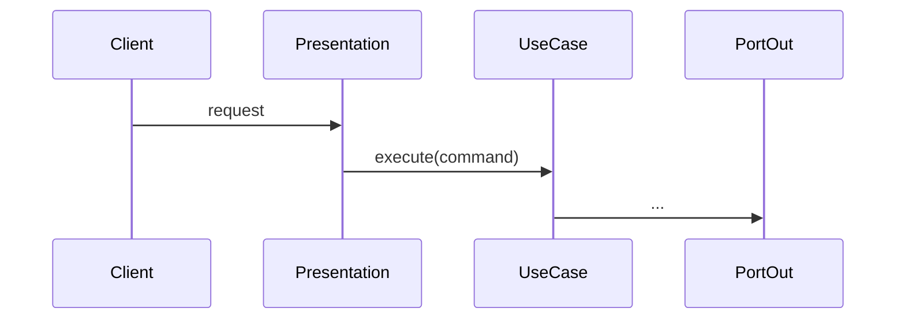

# {ModuleName} — Business Flows

## Flow: {Tên flow}

### Mô tả

(Business rules ngắn gọn)

### Sequence

```mermaid
sequenceDiagram
  participant Client
  participant Presentation
  participant UseCase
  participant PortOut
  Client->>Presentation: request
  Presentation->>UseCase: execute(command)
  UseCase->>PortOut: ...
```

### Use cases liên quan

- `{UseCase}`

### Edge cases

- 
