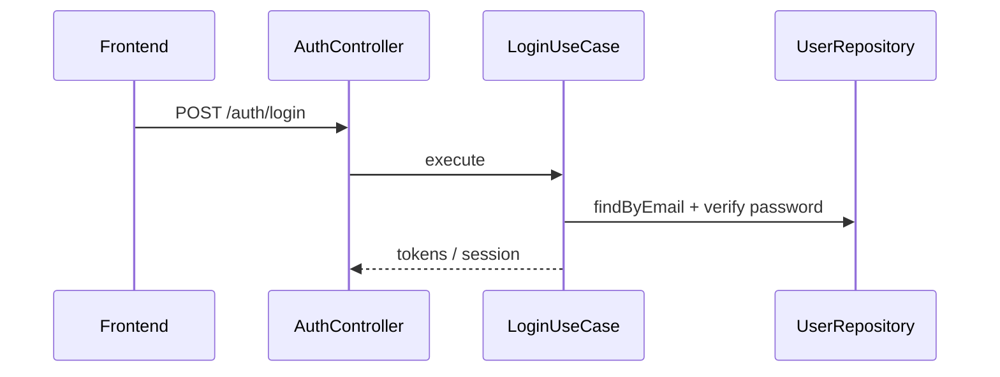
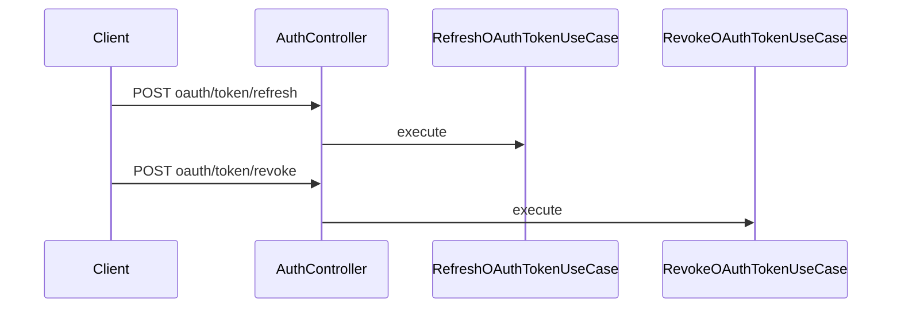

# Auth — Business Flows

## Flow: Email Login

## Flow: Web3 / Thirdweb Auth

`Web3AuthenticateUseCase` hoặc `Web3PayloadAuthenticateUseCase` — verify signature, find or create user, optional `ref_code` referral.

ATS: Thirdweb qua API gateway — xem [frontend-api-map.md](../../contracts/frontend-api-map.md).

## Flow: OAuth Token Lifecycle

## Flow: Password Reset

1. `ForgotPasswordUseCase` → email with token
2. `ValidateResetTokenUseCase` → GET validate
3. `ResetPasswordUseCase` → POST reset

## JWT in other modules

Routes dùng `OAuth2Guard` + `@CurrentUserId()` — business logic nằm trong domain use cases, không trong guard.
