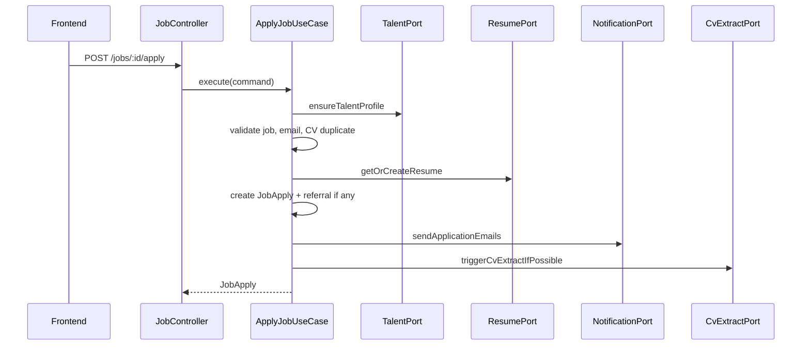
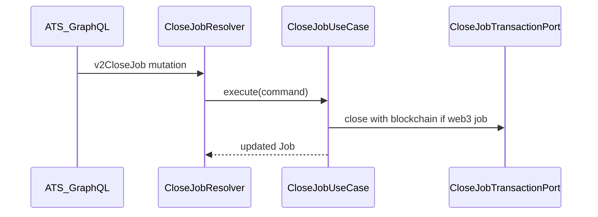
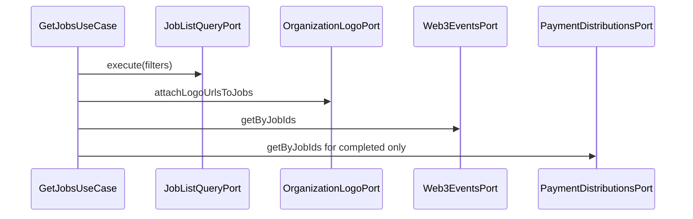

# Job — Business Flows

## Flow 1: Apply Job

### Mô tả

Talent ứng tuyển job: validate talent, job, email/CV duplicate, web3 nếu có → tạo JobApply → notification → CV extract async (nếu không có recruiter evaluation).

### Sequence

### Use cases

- `ApplyJobUseCase`

### Edge cases

- Apply method `email` → status `email_sent`, trigger CV extract
- Có `fitAssessment`/`matchScore` → skip CV extract trigger
- Referral ID → tạo job referral link trước apply

---

## Flow 2: Close Job

### Mô tả

Đóng job với lý do; có thể kèm blockchain transaction qua port out.

### Sequence

### Use cases

- `CloseJobUseCase`
- `GetCloseJobReasonsUseCase` (choice options)

---

## Flow 3: Job List/Detail Enrichment

### Mô tả

Sau khi load jobs, enrich organization logo, web3 events, payment distributions cho completed jobs.

### Sequence

### Use cases

- `GetJobsUseCase`
- `GetJobUseCase` (single job, same ports)

### Rule

Không duplicate enrich logic — dùng chung port out `ORGANIZATION_LOGO_PORT_OUT`, `WEB3_EVENTS_FOR_JOBS_PORT_OUT`, `PAYMENT_DISTRIBUTIONS_FOR_JOBS_PORT_OUT`.

---

## Flow 4: HR Add Candidate

### Mô tả

ATS thêm candidate qua REST; có bước extract resume riêng gọi FastAPI.

### Use cases

- `HrAddCandidateUseCase` — `POST /jobs/:id/hr_add_candidate`
- `HrAddCandidateExtractResumeUseCase` — `POST /jobs/:id/hr_add_candidate/extract_resume`

---

## Flow 5: Job Applies / Referrals List

Chi tiết filters, pagination, response shape: [job-applies-referrals.md](job-applies-referrals.md).
