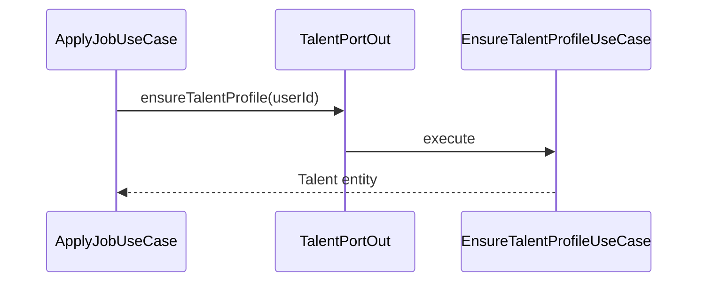
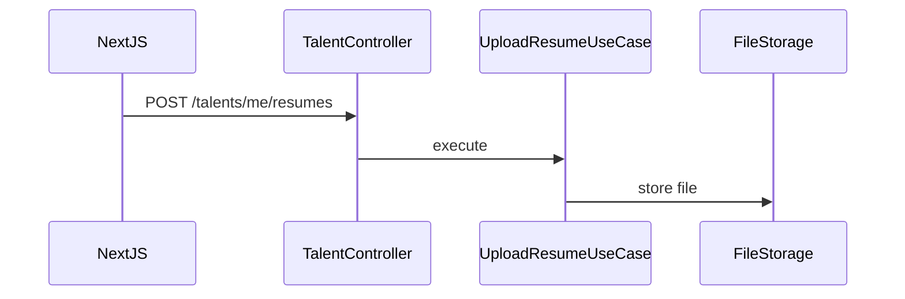

# Talent — Business Flows

## Flow: Ensure Talent Profile (cross-module)

Job apply và các flow khác gọi `EnsureTalentProfileUseCase` qua port out — không tạo talent inline.

## Flow: Resume Upload

## Flow: Onboarding

`OnboardingTalentUseCase` — POST/PUT `/me`, PATCH `/me/onboarding`. Cập nhật step, headline, skills sau signup.

## FastAPI boundary

CV extract/evaluate → frontend gọi FastAPI trực tiếp hoặc job apply trigger — không implement parse logic trong talent module.
