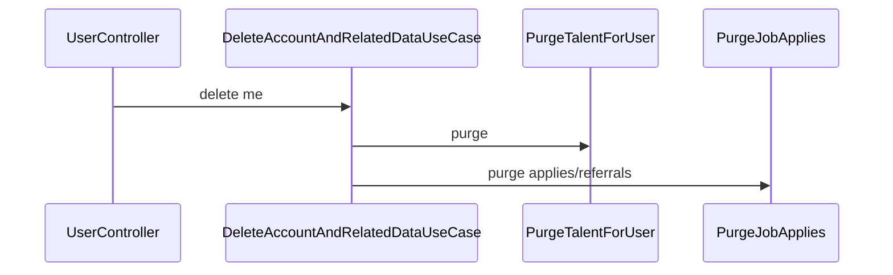

# User — Business Flows

## Flow: Profile Update

Frontend (Next.js GraphQL hoặc REST) → `UpdateUserProfileUseCase`. Talent-specific fields → `talent` module.

## Flow: Account Deletion

`DeleteCurrentUserCompletelyUseCase` / `DeleteAccountAndRelatedDataUseCase` — orchestrate purge across modules (talent, job, upp purge use cases).

## Flow: Profile Picture Presigned Upload

`GenerateMyProfilePicturePresignedUploadUseCase` → client upload direct to storage → confirm via profile picture endpoint.

## Boundary with auth

Register/login/OAuth → `auth` module only. User module handles entity persistence lookups used by auth use cases.
